<h1 align="center">
  techno-cv
  </h1>
 

  <i>Sam Castle, Ted Kane, Jack Polturak</i>  
  Dyson School of Design Engineering | Imperial College London | Audio Experience Design

  

    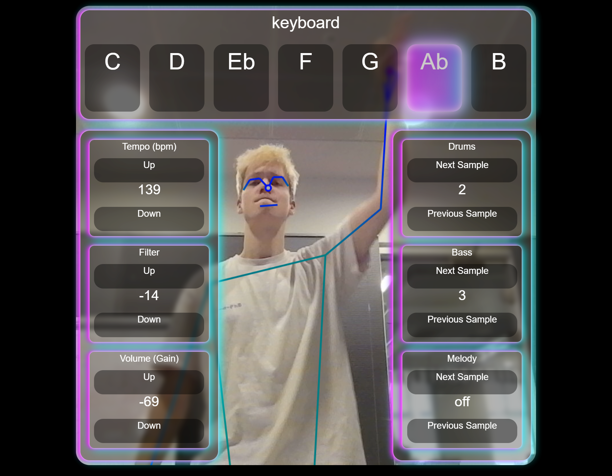

   
techno-cv is an interactive audio installation whereby a minimal techno track can be built-up and manipulated using just gestures. Displayed on a visual interface, samples can be selected and moulded, effects applied, and a sample synthesiser played, simply by moving one’s arms in space. The positions of your hands are tracked, using an opensource computer vision system, and used to trigger buttons on the interface. These buttons in turn manipulate the parameters of a custom Max 8 patch in which samples are layered and filters applied to create a versatile minimal techno track. A short video of the installation can be found <a href="https://youtu.be/G8Mb8XTaFfQ/">here</a>.
  

  

  <i>N.B. Whilst this report outlines the project as a whole, I have focussed on the work I personally contributed.</i>
  

  
## Gallery
  

    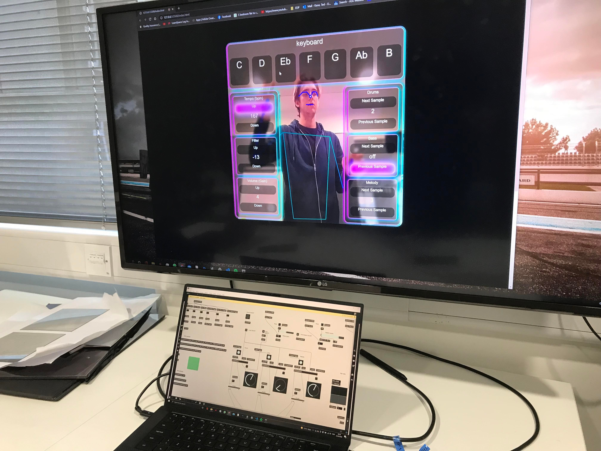

  

    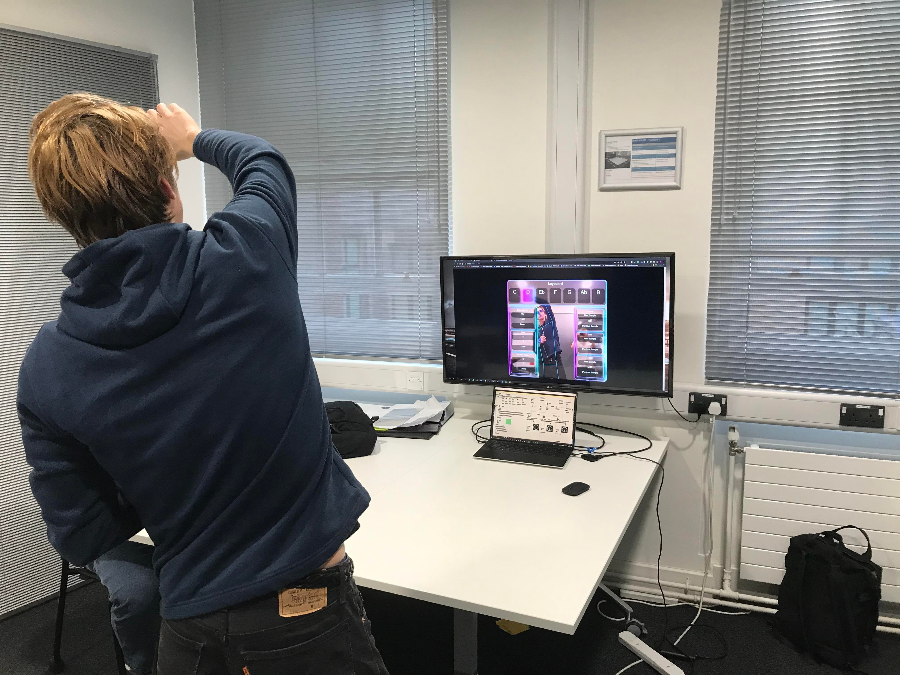

  

    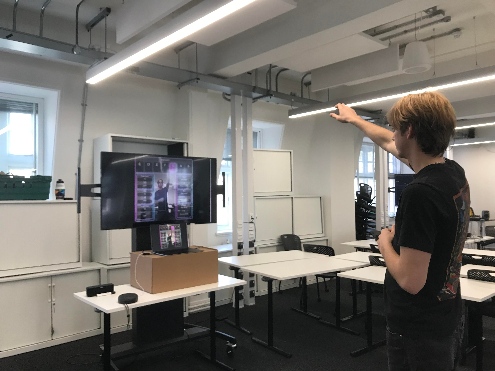

## Contents

  
Aim of the Work

  
  ## Aim of the Work
All three of us love dance music AND dancing to music. This project birthed from the thought: what if instead of **dancing to music** you could **dance to create music**? Too long have DJs been constrained to their decks, the aim of this work is to explore whether exciting and commercially viable dance music can be created in a manner that is more **expressive** and **stimulating**.
    
  

    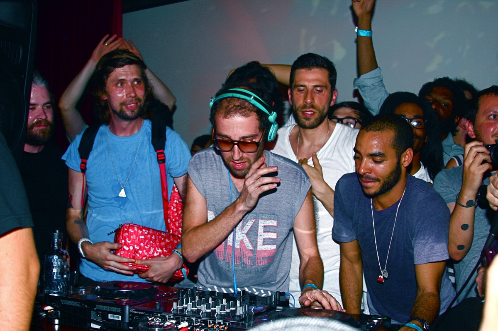

  <i>Thomas Bangalter at the decks</i>

  
Installation Architecture

  
  ## Installation Architecture
  The overall system can be broken down into four major components. Identifying the user’s hands, the user interface, selecting buttons and sending the selections as messages, and building a techno track based on the selected parameters.
  
  Hardware wise, the system technically only requires a laptop with a webcam, however the experience is significantly improved by using a large TV monitor and a loudspeaker for superior audio quality.
  
Here is a high-level system diagram of the installation:
    
   

    

  <i>High-level system diagram</i>

  
Computer Vision

  
  ## Computer Vision
To control the interface with gestures the hand positions of the user need to be tracked. To do so, the computer’s webcam is accessed and an opensource pose model was used, Google’s Media Pipe, a highly accurate, and responsive system. With this, the user’s hands are identified, their 2D coordinates on the screen are defined and then used to trigger samples and effects. The positions of the hands are shown visually on the screen for the user as a point of reference.
    
 

 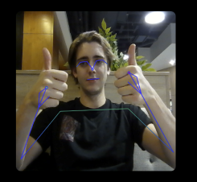

  <i>MediaPipe was used for pose tracking</i>

  
User Interface

  
  ## User Interface
The interface was built in HTML and hosted on a browser. It consists of an array of buttons to control the techno track. With the position of the hands known, a Javascript selection algorithm was used. If the correct hand’s XY coordinates fall within a certain known region for a specific button, the Javascript function both lights up the button and changes the value of the object on the interface, and sends a new OSC message to Max to control parts of the patch. These messages are sent via the node.js server which connects the corresponding ports (8080) and transfers the data stream. An example message would be a value between 0-127 for master volume.
  
  Have a play with the interface [here](https://posentunes.web.app/).
    
 

 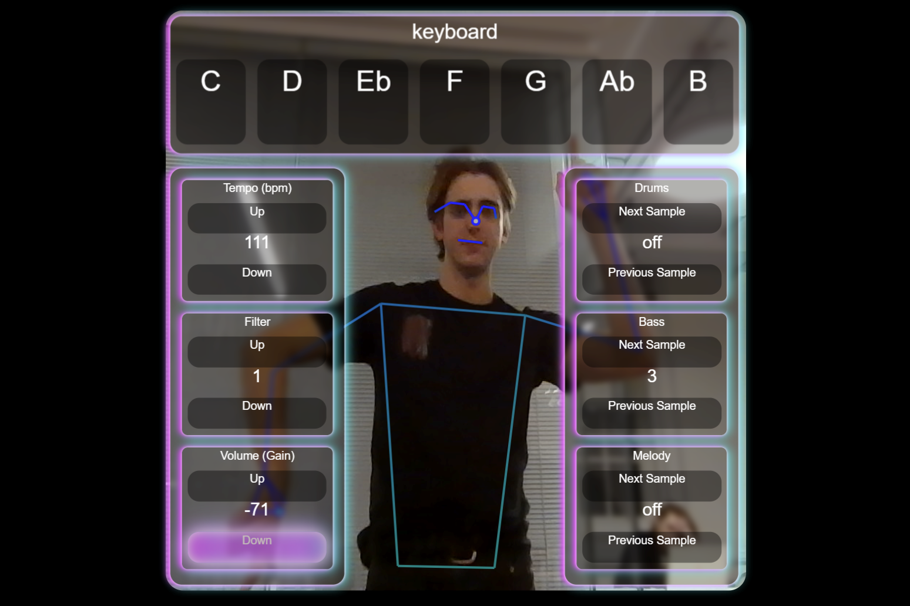

  <i>Our user interface</i>

  
Max Patch Overview

  
  ## Max Patch Overview
As I had prior experience working in Max 8, I created the audio control patch to take in the gesture inputs and build a track from them. The core functionality of the patch is based on a three-track looper which allows you to build up a simple techno track from a predefined set of samples and manipulate parameters such as tempo and volume. In addition, the patch allows you to apply effect filters, high- and lowpass, distorting the sound as DJs often do on their decks. Finally, the patch allows you to play a sample up and down a scale, perfectly in time, over the loop with a synchronised sample synthesiser.
  
Therefore, we can split the functionality of the patch down into four main stages: selecting the samples, looping the samples (and controlling their gain and tempo), applying high and lowpass filters, and playing the sample synth on the predefined scale.
  
**The patch can be controlled with the gesture inputs via the computer vision system or via the Max interface and key presses on the computer keyboard.**
    
   

    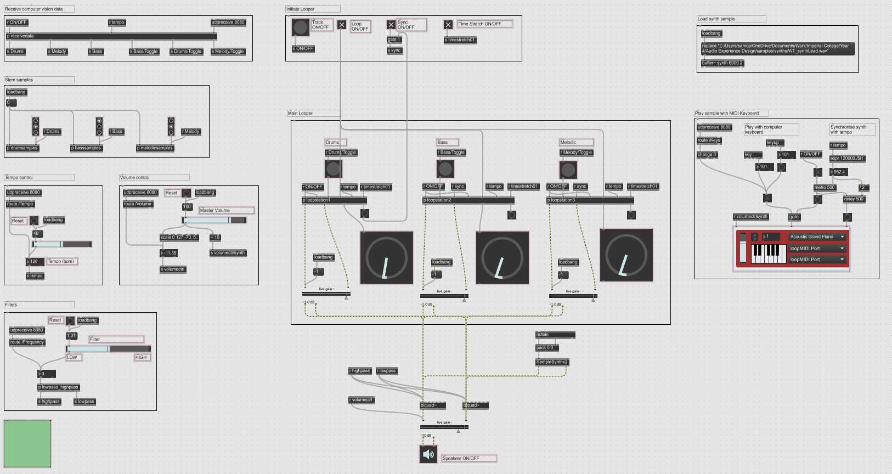

  <i>Top level of Max patch</i>

  
  

   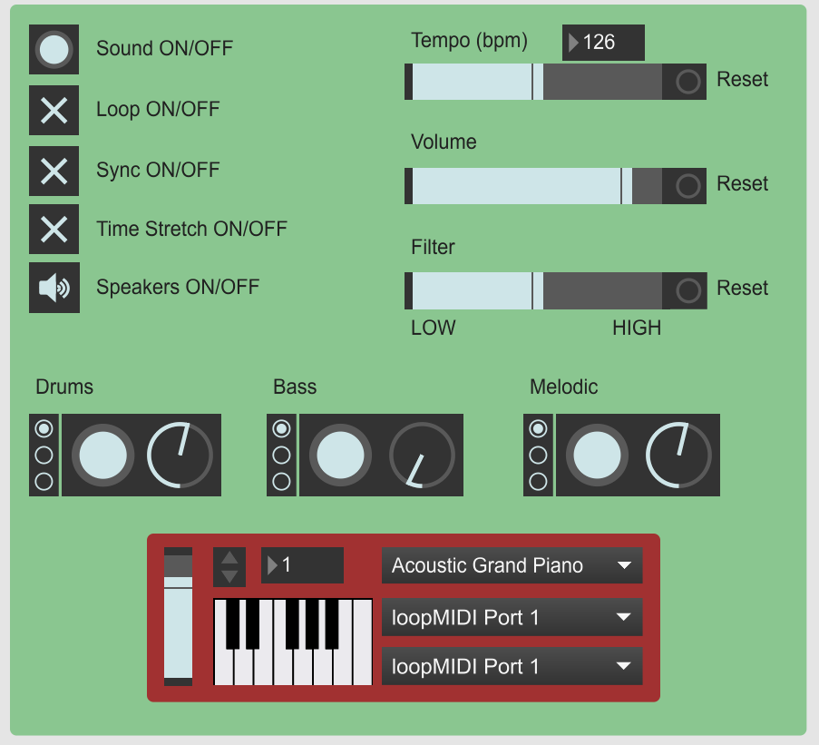

  <i>Patch in presentation mode</i>

  
    

  
Selecting Samples

  
  ## Selecting Samples
  ### Choosing Coherent Samples
The track is split into three stems: the drumbeat, the bassline, and a melodic line to create polyphony with the bass. For each stem there is a choice of three different samples from which the track can be built, and additionally a stem may be silenced completely. With at least one stem playing there are 63 (43 -1) discreet possibilities for the composition, however since each stem’s sample can be switched multiple times mid track, the options are actually fairly extensive. In addition to the looping samples, an appropriate synthesiser sample, for the sample synth element also had to be chosen.
  
The samples were downloaded from the free sample library at BandLab. A great deal of care was taken in picking samples that would sound consonant in all configurations and create a sound appropriate of the genre. The samples themselves were all converted to the same key (C minor) and tempo (126 bpm) before being loaded into the patch. I did this originally using Audacity, applying pitch shift and tempo effects, later realising it could be done directly on the BandLab website before download!

   ### Switching Between Samples
  With the samples chosen, they were loaded into the Max patch. This was achieved using four buffers (**buffer~**), one for each stem and one for the sample synth. Using **radiogroups** a new sample can be loaded into the buffer by clicking on the corresponding dot. Inside the subpatchers **drumsamples**, **basssamples**, and **melodicsamples**, replace messages, calling .wav files from the computer, are sent to the buffer with the **select** function. The new sample carries on playing from the same point in the buffer allowing the track to remain synchronised.
      
   

    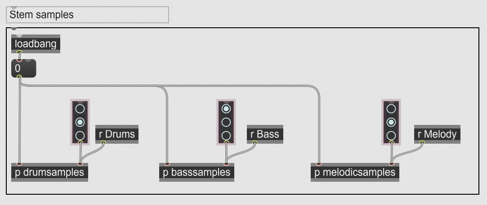
 

 

  <i>Choose between multiple samples for each stem</i>
 
  
      
   

    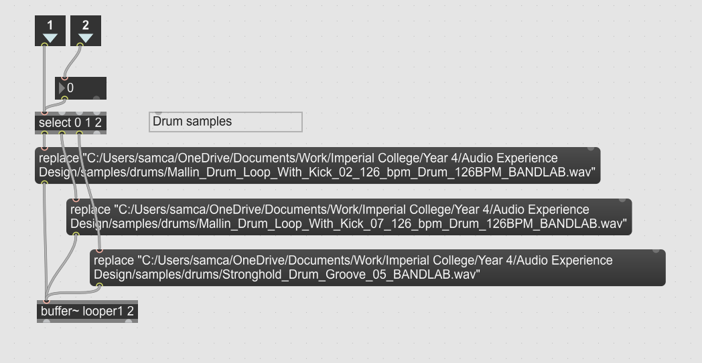
 

 

  <i>.wav file samples are loaded into the buffers</i>
 
  
        

To control the sample switches using the computer vision inputs, the patch needed a way to take in that data. The **udpreceive** function (port 8080) takes in streams of OSC data from Javascript, via the Node server, for each stem and channels them into the **receivedata** subpatcher. For each variable the choice of sample (off, 1, 2 or 3) is sent into an **int** function, storing the selection until a beat from the metronome is sent through. Since the data input is a continuous stream, the **change** function is used to only identify when the selection has changed.
  
    
   

    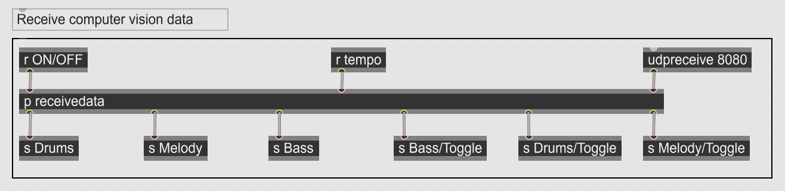

  <i>OSC data routed to receivedata subpatch using udpreceive</i>

  
      
   

    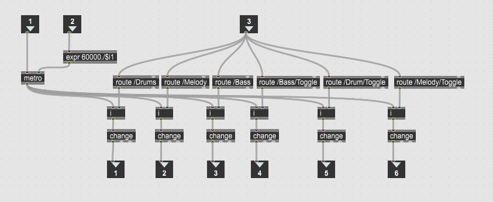

  <i>Samples are switched on the beat</i>

   

  
The Looper

  
  ## The Looper
The looping function is built around the **groove~** function in Max. This function accesses the buffer to which it is assigned and allows it to be looped. It also allows various parameters to be controlled, with values brought in with **udpreceive** from the Node server. Tempo is controlled by changing the speed of the signal running into **groove~**. The Time Stretch function has been used to stop the samples from changing pitch when the tempo is increased. The volume of the track is controlled by simply scaling the OSC input to appropriate dB values (-70 to +6) and using that to drive the master gain. The gain of each stem can be controlled within the patch, to mix the track, however this has been pre-mixed to appropriate values for a good balance.
    
   

    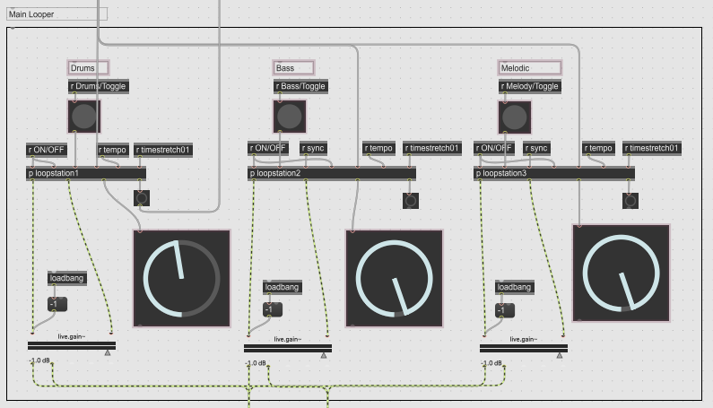

  <i>A three-track looper layers the different stems</i>

  
    
   

    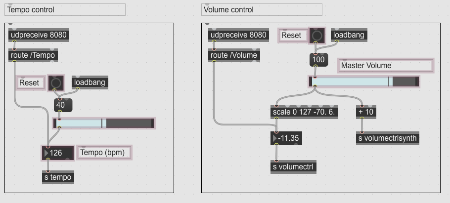

  <i>Tempo and volume are driven by OSC command messages</i>

  
      
   

    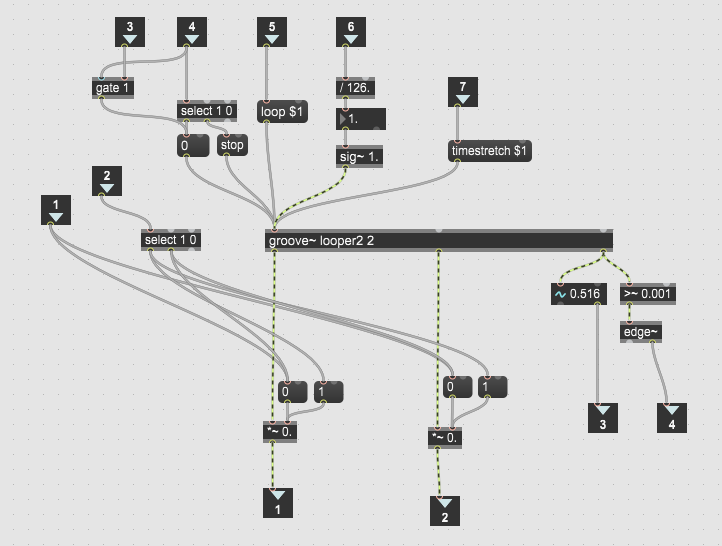

  <i>A look inside the loopstation subpatches</i>

   
  
To start building a track each stem loop must be initiated, by selecting ‘Track ON/OFF’. This starts the stems synchronously and silently until the sound for each is turned ion. Technically, the ‘turning on/off’ of the stems is achieved by setting the amplitude of signal to 0, if toggled off, and 1, if toggled on. The ‘Loop’, ‘Sync’, ‘Time Stretch’ and ‘Speakers’ toggles all also must be turned on at the programs start. Since some of the samples are different lengths, the Loop Sync output of **groove~** is used to start the other loops from the beginning whenever the drumbeat reaches the start of the sample. 
   
   

    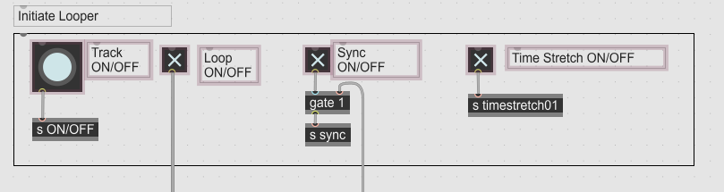

  <i>Initiate the looper with these parameters</i>

  

  
Filtering Effects

  
  ## Filtering Effects
Lowpass and highpass filtering can be added to the track similarly to the tempo and volume. Using an **if else** function, the upper half of the slider controls the highpass filter and the lower half controls the lowpass filter. Inside the **lowpass_highpass** subpatch, the **filtergraph~** function is used to select the filter shapes, and the slider value (scaled), is used to drive the cut off frequency and gain. With the filter shape defined, the **biquad~** function is used to implement the filter to both audio channels, applying the distinctive sound effect incorporated in most DJ decks. Filtering can be used to hide the transitions between loops to create a seamless audio experience.
  
    
   

    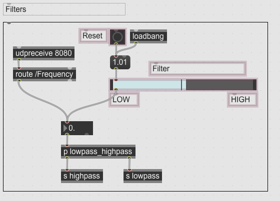

  <i>The OSC message for filter level is sent into the lowpass_highpass subpatcher</i>

  
    
   

    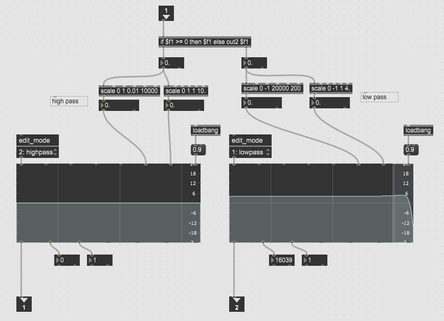

  <i>A highpass filter is added for positive values and a lowpass for negative</i>

  

  
Sample Synthesiser

  
  ## Sample Synthesiser
The most complex part of the patch is the sample synthesiser. It can be split into three functions: the control of a MIDI keyboard, syncing the notes to the track and using the keyboard to play the sample at different pitches.
  
  ### MIDI Keyboard
The keyboard is played by holding your hand over the desired key on screen. When a key is selected its number is sent through a selector sends out the corresponding MIDI value for the note. The MIDI values here make up the C harmonic minor scale. Next this MIDI value has a defined multiple of 12 added, to shift the note up or down the octave. It is then packaged up with a key velocity value given by the global volume control and sent out as a MIDI message with the **midiformat** function. The note is released in a similar way: a message for the key release is sent through, this time with a key velocity of 0. This cuts the played note off.  
     
   

    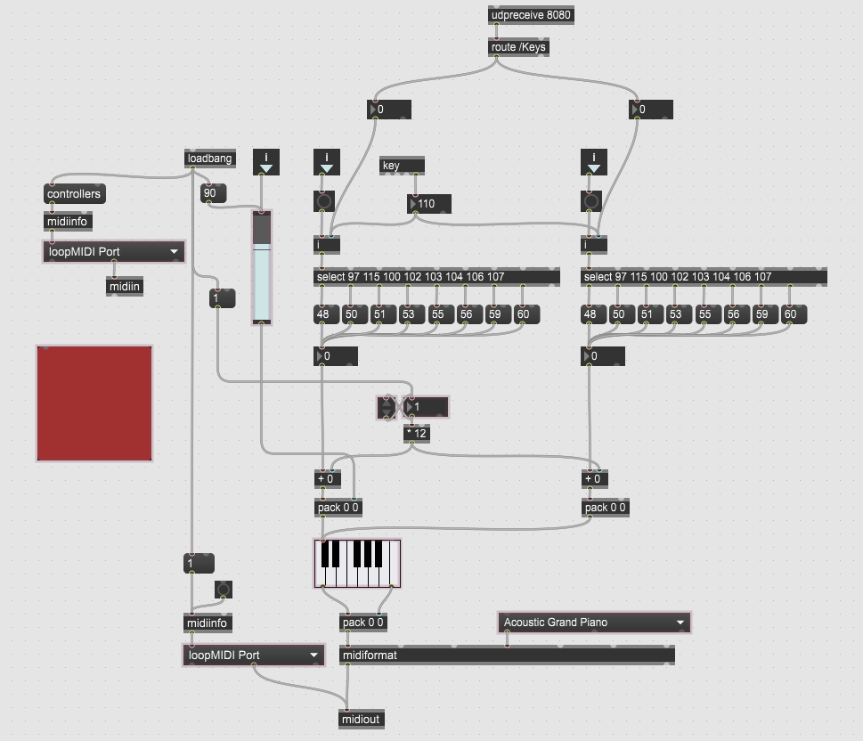
 

 

  <i>Transforming note selections into MIDI data</i>
 
  
      

  ### Syncing the Keyboard
The keyboard has been configured to only play in time with the music. This was achieved by syncing it to the main looper with a metronome at the tempo dictated by the tempo slider in ms. The metronome sends out a bang every two beats, but this is only allowed through the **gate** into the **simplekeyboardv2** bpatcher when the computer vision recognises the hand over a key. This means the keyboard will play in time and only when a key is selected. The metronome also sends a delayed bang on the offbeat which triggers the key to be released inside the keyboard bpatcher. 
     
   

    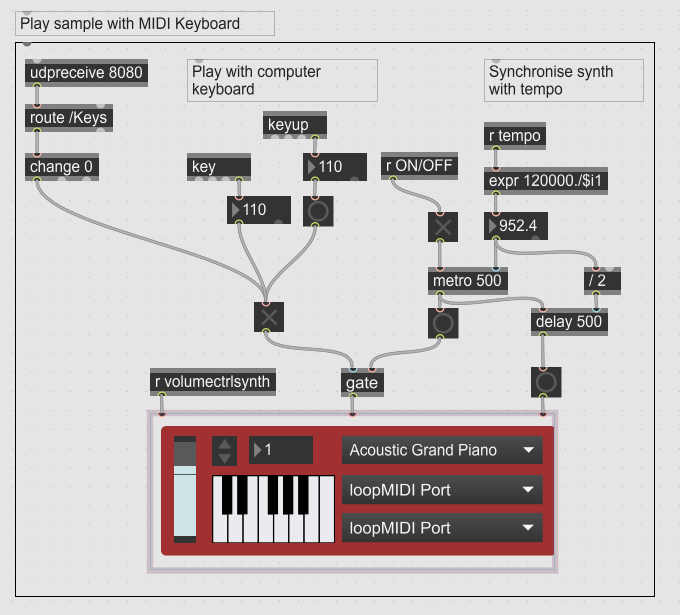
 

 

  <i>Syncing the MIDI keyboard to the beat</i>
 
  
      
 
  
   ### Playing a Sample
With the keyboard playing in time, it can be used to control and manipulate our synth sample. This is done in a custom function I built, called **SampleSynthv2**. The **notein** function receives our MIDI note-on and note-off messages from the keyboard and sends them into **SampleSynthv2**. Inside the MIDI messages are unpacked into note number and key velocity (i.e. volume). If the volume is non-zero, indicating a key has been selected, a message to start playing the sample loaded in the synth buffer is sent out. The volume is also scaled to decibels and used to control the live gain of the sample.
  
The MIDI note number is converted to frequency (**mtof**), and then divided by the frequency of C4. This creates a scaling factor with which the sample can be pitch shifted, to play the sample at the pitch of the note played. The playback speed of the sample is also defined by the main tempo slider for the patch, with **Timestretch** again being applied to ensure any change to the tempo will not affect the pitch of the sample.
    
   

    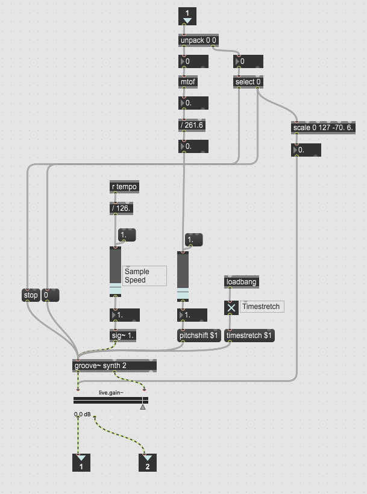
 

 

  <i>Pitch shifting the synth sample to the note played on the keyboard</i>
 
  
      
 

  

  
Review and Future Work

  
  ## Review and Future Work
Our installation was a huge success with everyone who tried it, both during testing and the demo day presentation at the Dyson School, 22/03/22. I think a good indicator of success was the number of people pulling out their phones to take videos, and we were asked to showcase the work at the School's Open House Exhibition in June.
  
Users were able to easily pick up the interaction and get good results quickly. What was interesting too was that although the installation doesn’t require the user to dance when interacting with it, there were a lot of club-like dance moves on show, I think in part influenced by the clever placement of the sample synth at the top of the installation.
  
There were however a few issues highlighted by the demos:
-	The sensitivity of some buttons was too high, with volume and filters being effected when accidently brushed.
-	The computer vision sometimes struggles if there are multiple people in frame.
-	The height differences meant that the webcam sometimes had to be adjusted to facilitate some users.
-	After a great number of people had tried it, we were starting to get a little bored of the samples!
  
These issues suggest that the following improvements should be made:
-	Develop open hand, closed hand recognition for selecting buttons, this way sliders could be incorporated for more sweeping gestures.
-	Create a calibration mode to adjust for height differences.
-	Develop a greater range of samples, perhaps in sample packs for different genres.
  
Aside from these issues, I think it would also be interesting to develop this concept as a webapp so that anyone could use it anywhere. Finally, in our initial workplan we had considered adding a binaural element to the design, spatialising different stems to better differentiate them. Personally, I don’t think this would be logical area for the progression of the concept. Dance music is best enjoyed in a crowd, so a better course of action would be to optimise the system for large nightclubs such as Printworks.

  
Acknowledgements

  
  ## Acknowledgements
I would particularly like to thank Dr Lorenzo Picinali for his support and guidance through the development of the Max patch. In addition, the tutorials of <a href="https://www.youtube.com/user/dearjohnreed">dearjohnreed</a> were a very helpful start point for several parts of the patch.

